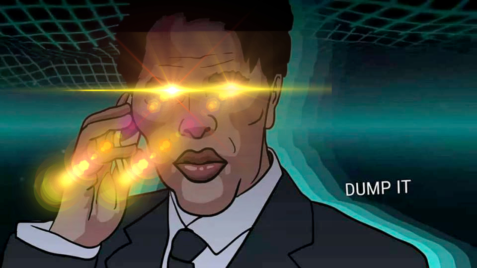

How I found out that Bogdanoff (the crypto boogeyman) is real. Here's my story:

**may 11 early morning**: ust loses its peg and crypto markets tumble, maybe i should focus on the arbs and shorts today

**may 11 midday**: cornell music festival, got a nice tan 

**may 12 12am**: on a 5 game aram win streak, i always knew i could perform 

**may 12 12:30am**: see my server logs after alt tabbing by accident, by chance notice an arb come in, ten minutes later dozens more come in, oh shit its the meltdown today

**may 12 12:35**: why cant i make the arbs? why are they failing? *months earlier* i move my trading capital out into the pools to take out a loan to finance a bulking phase *today* fees are way too high as ppl are scrambling to trade onchain for me to pay for with the measly capital that is left

**may 12 12:40**: ill just buy more crypto, i have three banks accounts

**may 12 12:45**: coinbase takes 6 days to move funds out, so i try smaller providers, but bank account 1 fails: unknown offshore provider, bank account 2 fails: bank not supported, bank account 3 fails: zelle service down, please contact support,.,,.,,,,,,.,.,.

**may 12 2 am**: i try to google for more options, suddenly my internet cuts out, it has never done that before

**may 12 2:11**: in a last ditch effort, i contact the Citizens of chad, hoping by some miracle they save me

**may 12 2:30**: no response. its over.

Bog systematically distracted me, called the banks to lock me out of liquidity, and even cut out my internet. I guess I'd have to spend the summer interning at Mcdonalds.

He baught?

